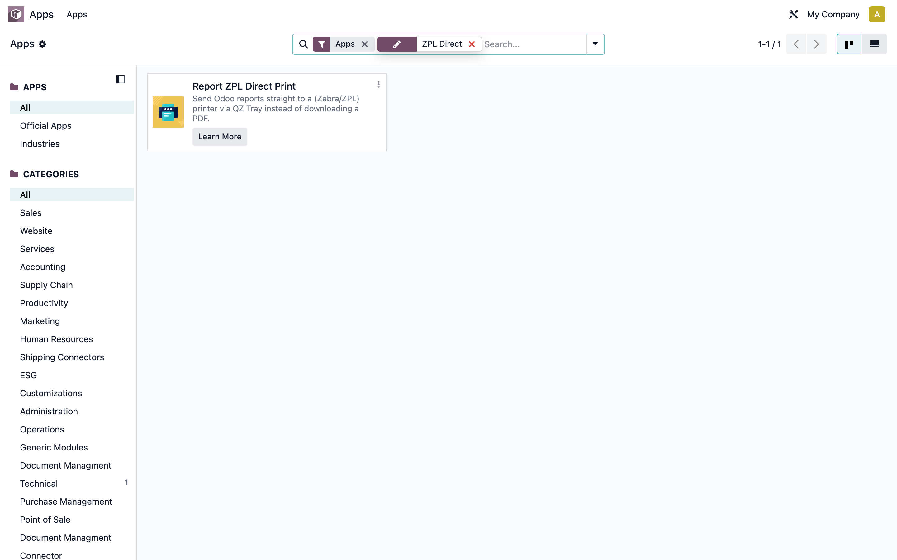
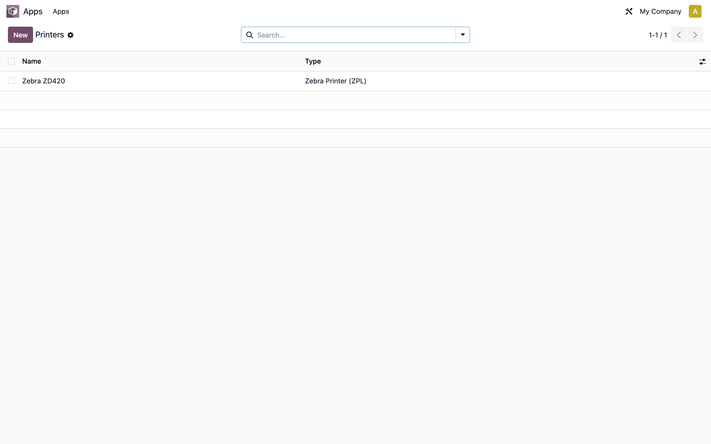
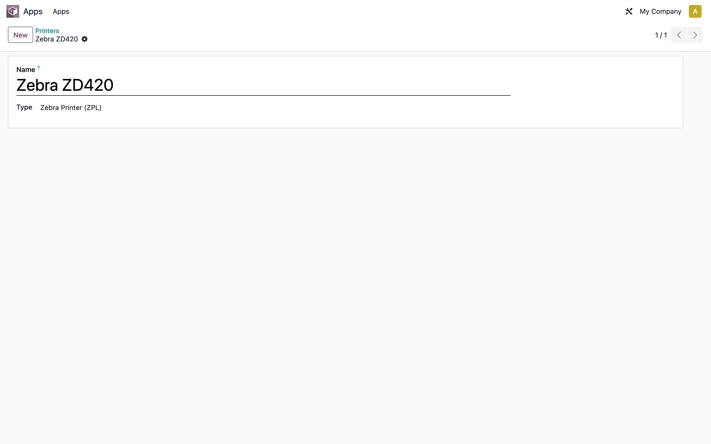
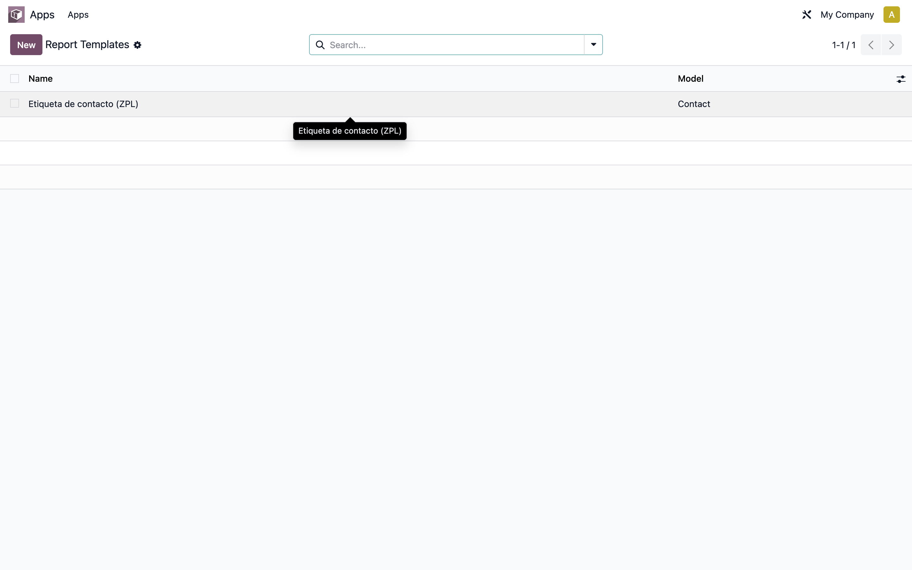
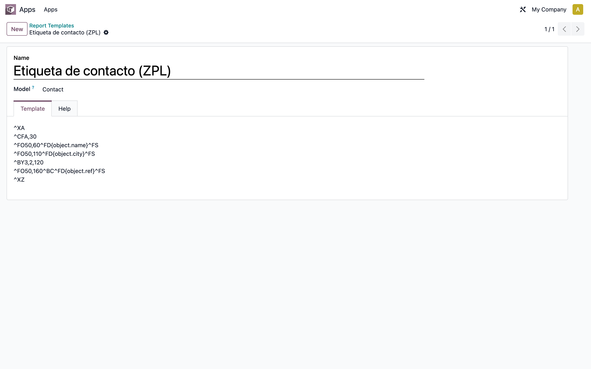
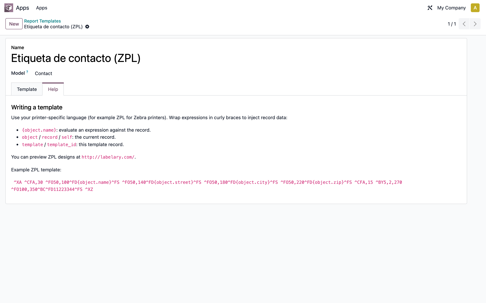
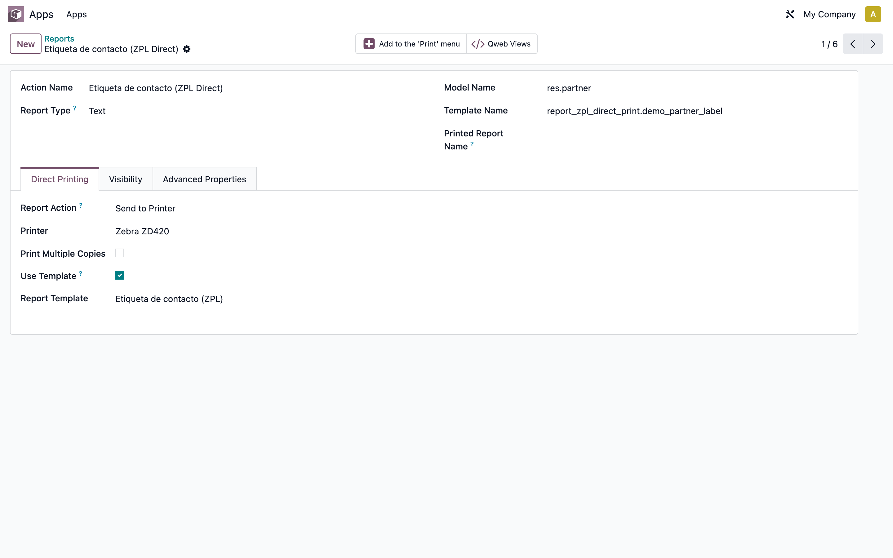

# Report ZPL Direct Print — Manual de usuario

> Manual generado con `tools/manual-generator`. Las capturas se regeneran ejecutando el generador contra una base `test_v19_<módulo>`.

**Report ZPL Direct Print** envía reportes de Odoo directamente a una impresora (típicamente una Zebra / ZPL) a través de [QZ Tray](https://qz.io/), en lugar de descargar un PDF. Está pensado para impresión de etiquetas (productos, envíos, códigos de barras) en almacenes y puntos de venta.

Este manual cubre la **instalación y configuración dentro de Odoo**. La impresión física se ejecuta en el navegador del usuario contra la app de escritorio QZ Tray; ese paso se describe en texto al final.

## Requisitos previos

- La librería Python `zplgrf` instalada en el servidor (`pip install zplgrf`), solo necesaria para la ruta PDF→ZPL.
- La aplicación de escritorio QZ Tray instalada y corriendo en la PC del usuario que imprime.
- La impresora dada de alta en QZ Tray, con el mismo nombre que se usará en Odoo.
- Modo desarrollador activado en Odoo para ver los menús de Impresoras y Plantillas (Ajustes → Activar modo desarrollador).

## 1. Instalación del módulo

En **Aplicaciones**, busca «ZPL Direct» y pulsa **Activar/Instalar** en *Report ZPL Direct Print*. Si la lista no muestra el módulo, pulsa primero *Actualizar lista de aplicaciones* (requiere modo desarrollador).

## 2. Catálogo de impresoras

Ve a **Ajustes → Técnico → Informes → Printers**. Aquí se listan las impresoras disponibles para impresión directa. Cada registro representa una impresora física conocida por QZ Tray.

## 3. Crear una impresora

Pulsa **Nuevo** y captura el **Nombre** exactamente igual al nombre con el que la impresora aparece en QZ Tray / el sistema operativo. Deja el **Tipo** en *Zebra Printer (ZPL)*. Guarda.

## 4. Plantillas de etiqueta

Ve a **Ajustes → Técnico → Informes → Report Templates**. Las plantillas contienen el código de la etiqueta (ZPL) con marcadores que se rellenan con los datos de cada registro al imprimir.

## 5. Crear una plantilla

Pulsa **Nuevo**, dale un **Nombre**, elige el **Modelo** sobre el que aplica (por ejemplo *Contacto* o *Producto*) y escribe el código ZPL en la pestaña **Template**. Envuelve las expresiones entre llaves para inyectar datos del registro, por ejemplo `{object.name}`.

## 6. Ayuda de sintaxis de plantilla

La pestaña **Help** del formulario de plantilla documenta los marcadores disponibles: `object`/`record`/`self` para el registro actual y `template`/`template_id` para la propia plantilla, además de un ejemplo ZPL y un enlace a labelary.com para previsualizar diseños.

## 7. Configurar un reporte para impresión directa

Ve a **Ajustes → Técnico → Informes → Informes**, abre el reporte deseado y entra en la pestaña **Direct Printing**. Cambia *Report Action* a **Send to Printer**, elige la **Impresora** y, opcionalmente, marca **Use Template** + la **Plantilla**, o **Print Multiple Copies** + el número de copias por defecto.

## 8. Imprimir

Con el reporte configurado como *Send to Printer*, al pulsar **Imprimir** sobre uno o varios registros (botón Imprimir del formulario/lista) Odoo no descarga el PDF: se conecta a QZ Tray en la PC del usuario y envía la etiqueta a la impresora.

- Si la impresora configurada está disponible y no hay multi-copia, imprime directo.
- Si no, aparece un diálogo para elegir impresora y/o número de copias.
- Si QZ Tray no está corriendo, Odoo muestra una notificación de error.

> Este paso depende de QZ Tray (app de escritorio) y no se captura en este manual automatizado; valida la configuración previa dentro de Odoo y prueba la impresión en una estación con QZ Tray instalado.

## Notas

Permisos: los usuarios internos pueden **leer** impresoras y plantillas; solo los administradores (Ajustes) pueden crearlas o editarlas. Las expresiones de plantilla se evalúan con `safe_eval`.
