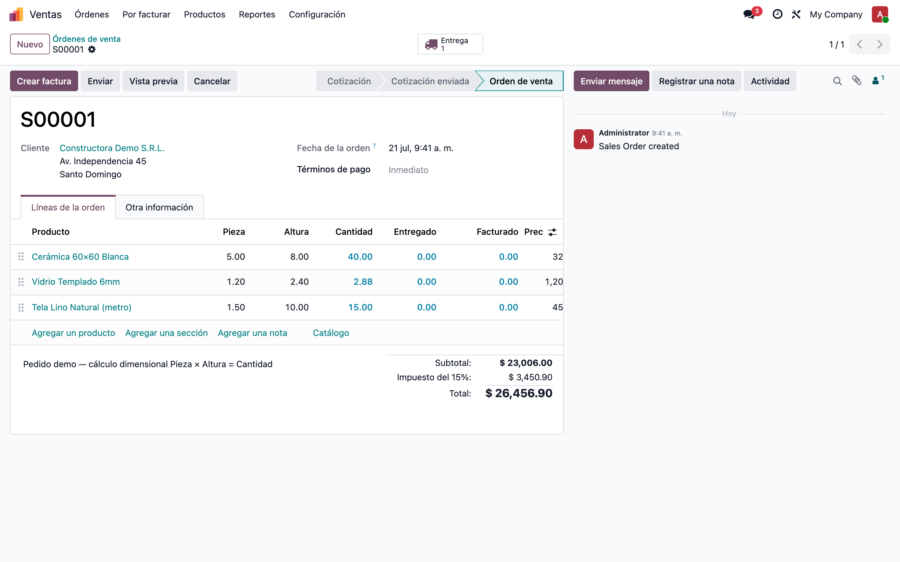
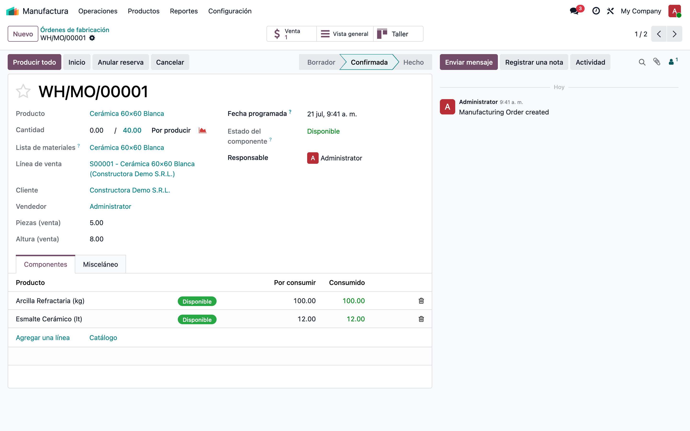
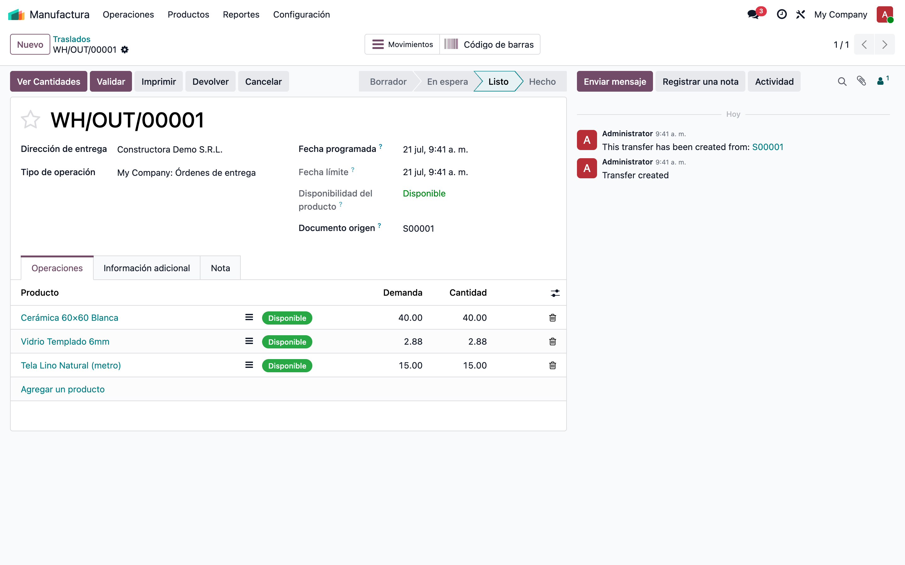
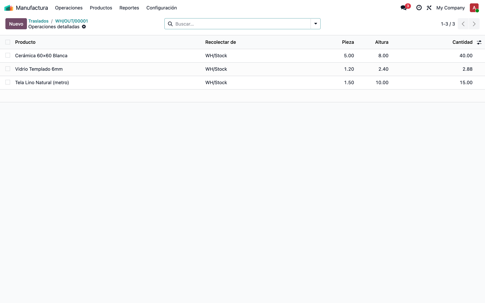

# Venta Dimensional (Pieza × Altura) — Manual de usuario

> Manual generado con `tools/manual-generator`. Las capturas se regeneran ejecutando el generador contra una base `test_v19_<módulo>`.

El módulo `sale_mr_inherit_modify` agrega **cálculo dimensional** al flujo Venta → Fabricación → Entrega. En las líneas del pedido se capturan **Pieza** (ancho / unidades) y **Altura**: la cantidad se calcula sola (Pieza × Altura). Esas dimensiones viajan al resto del flujo: la **orden de fabricación** muestra la línea de venta origen con su cliente, vendedor y dimensiones, y en la **entrega** un botón copia las dimensiones a las operaciones de inventario.

## Requisitos previos

- Apps **Ventas**, **Fabricación** e **Inventario** instaladas (el módulo las trae como dependencias).
- No requiere grupos de seguridad adicionales: usa los permisos nativos de cada app.

## 1. Pedido de venta — columnas Pieza y Altura

**Ventas → Pedidos** (o Cotizaciones). En las líneas del pedido aparecen las columnas **Pieza** y **Altura** justo antes de **Cantidad**. Al escribir cualquiera de las dos, la cantidad se recalcula al momento: `Cantidad = Pieza × Altura`. Ejemplo: 5 piezas × 8 m = 40 unidades de cerámica. Las dos columnas son opcionales (icono ⚙ del encabezado de la lista) y vienen visibles por defecto.

## 2. Orden de fabricación — datos de la venta origen

**Fabricación → Órdenes de fabricación.** Debajo de la lista de materiales, la orden muestra los datos de la venta que la origina: **Línea de venta**, **Cliente**, **Vendedor**, **Piezas (venta)** y **Altura (venta)**. Los cuatro últimos se llenan solos al vincular la línea. Si la orden se creó con *Documento origen* = número del pedido, el método `find_qty` vincula la línea automáticamente buscando el producto en ese pedido.

## 3. Entrega — botón "Ver Cantidades"

**Inventario → Transferencias** (la entrega se crea sola al confirmar el pedido). En el encabezado aparece el botón **Ver Cantidades**: al pulsarlo, el módulo busca el pedido de venta por el *Documento origen* y copia **Pieza** y **Altura** de cada línea de venta a los movimientos y operaciones detalladas del producto correspondiente.

## 4. Operaciones detalladas — dimensiones sincronizadas

Dentro de la entrega, el botón inteligente **Moves** (icono ☰, arriba a la derecha) abre la lista de **operaciones detalladas**. Ahí se ven las columnas **Pieza** y **Altura** con los valores copiados desde el pedido, justo antes de la cantidad. En esta captura: cerámica 5×8, vidrio 1.2×2.4 y tela 1.5×10, tal como se capturaron en la venta.

## 5. El flujo completo, de un vistazo

1. **Venta**: en la línea del pedido se capturan Pieza y Altura → la cantidad se calcula sola.
2. **Confirmación**: Odoo genera la entrega (y las órdenes de fabricación según las rutas).
3. **Fabricación**: la orden vinculada a la línea de venta muestra cliente, vendedor y dimensiones; si solo tiene el documento origen, `find_qty` la vincula.
4. **Entrega**: el botón *Ver Cantidades* copia las dimensiones de la venta a los movimientos y operaciones detalladas, para que almacén prepare por piezas y altura en lugar de solo la cantidad total.

## Notas

- **Pieza** y **Altura** son flotantes libres: el módulo no valida unidades; la convención (metros, unidades, m²) la define el negocio en la descripción del producto.
- El recálculo `Cantidad = Pieza × Altura` es un *onchange*: solo corre al editar en pantalla. Cambios por importación o API deben traer la cantidad ya calculada.
- `Ver Cantidades` y `find_qty` de fabricación emparejan **por producto** dentro del pedido del documento origen. **Precaución**: si el mismo producto aparece en varias líneas del pedido, todas las operaciones de ese producto reciben las dimensiones de la última línea — para dimensiones distintas del mismo producto, usar pedidos separados.
- Campos técnicos: `sale.order.line.new_qty/new_height`, espejo en `stock.move` y `stock.move.line`; en `mrp.production` son relacionados de la línea de venta (`qty_sale`, `height_sale`, `partner_id`, `vendedor`).
