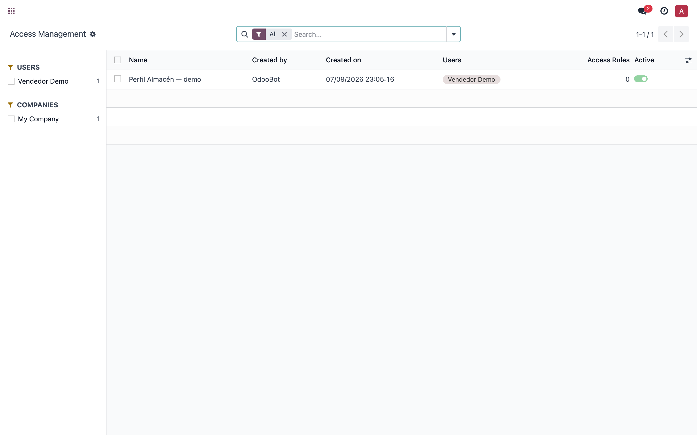
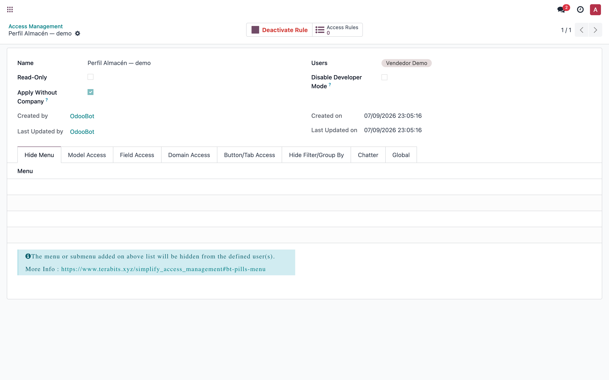
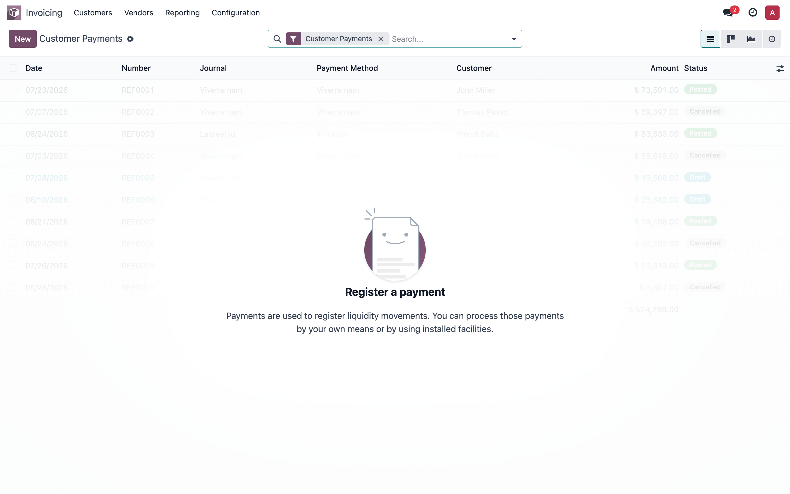
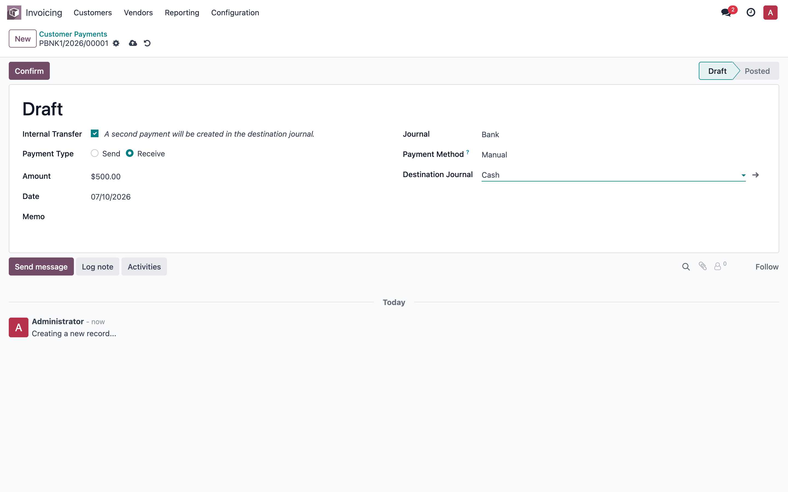
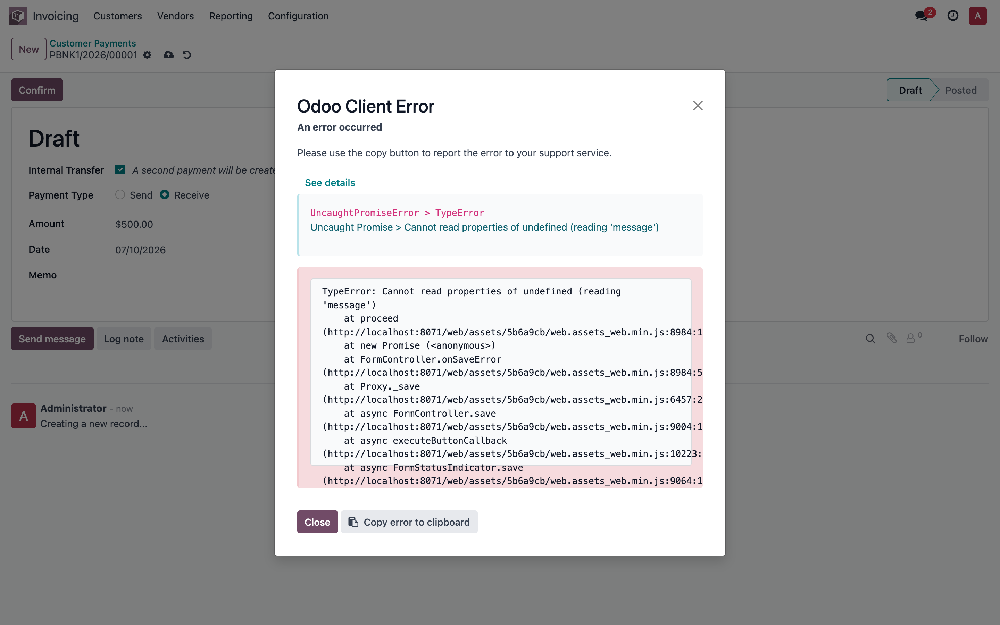
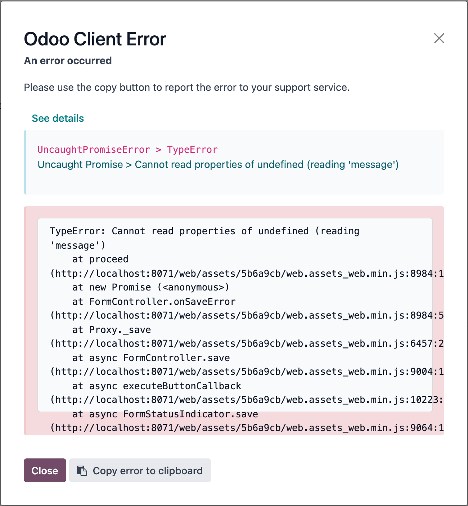
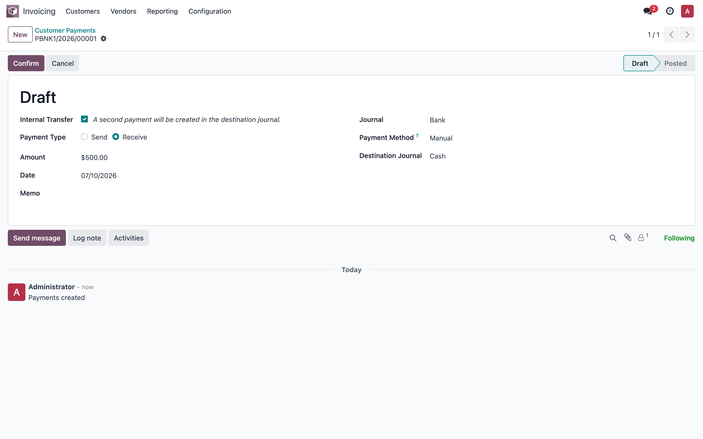

# Réplica del error "UncaughtPromiseError > TypeError: Cannot read properties of undefined (reading 'message')" al guardar un pago (transferencia interna)

> Manual generado con `tools/manual-generator`. Las capturas se regeneran ejecutando el generador contra una base de prueba dedicada.

Este manual replica, en un contenedor local, el error que ocurre en producción al guardar registros — aquí demostrado con un **pago de transferencia interna** (`account.payment`, diario *Bank* → *Cash*) — cuando `simplify_access_management` está instalado.

**Cadena causal (verificada en código):**

1. `simplify_access_management/controllers/action.py:61` ejecuta `request.env.registry.clear_all_caches()` en **cada carga de `/web`** (cualquier usuario, cualquier F5). Eso vacía todos los `ormcache` (ACLs, record rules, campos, vistas, menús, traducciones) y, vía `signal_changes()` (`odoo/modules/registry.py:866`), obliga a **todos los workers** a invalidar sus caches en su siguiente request.
2. Con caches frías y usuarios concurrentes, el `web_save` pasa de milisegundos a segundos; PostgreSQL cancela transacciones solapadas (`could not serialize access`) y Odoo reintenta hasta 5 veces (`odoo/service/model.py:24`), multiplicando la duración.
3. Cuando la duración supera el timeout del proxy (Cloudflare corta en ~100 s con error **524**; nginx con `proxy_read_timeout` devuelve **504/502**), el navegador recibe **HTML en vez de JSON-RPC**. `rpc_service.js` lo convierte en `ConnectionLostError`, que **no tiene `.data`**.
4. `FormController.onSaveError` (`odoo/addons/web/static/src/views/form/form_controller.js:331`) hace `error.data.message` sin verificar que `error.data` exista → `TypeError: Cannot read properties of undefined (reading 'message')` — exactamente el error visto en producción.

El error es **agnóstico del modelo**: ocurre con cualquier guardado de formulario (`web_save`) cuya respuesta no llegue como JSON-RPC — pagos, transferencias de inventario, órdenes de venta. En esta réplica el paso 3 se emula de forma **determinística** interceptando el request `web_save` del pago y respondiendo `504 Gateway Time-out` con cuerpo HTML (lo mismo que entrega Cloudflare/nginx al cortar). Los pasos 1–2 (la tormenta de cache que en producción provoca ese timeout) se demuestran con mediciones al final del manual.

## Requisitos previos

- Docker Desktop corriendo con el contenedor `lfernandez_v17` arriba (`docker-compose up -d`).
- Node.js + Google Chrome del sistema (Playwright usa el canal `chrome`).
- Generación: `cd tools/manual-generator && ./generate-manual.sh --module=simplify_access_management --extra-modules=account --keep-db`.
- El generador crea la base `test_v17_simplify_access_management`, instala `simplify_access_management` + `account`, siembra el plan contable genérico (diarios Bank/Cash) y un perfil demo, y toma las capturas contra un servidor Odoo efímero.

## 1. El módulo instalado — Access Studio

Con el módulo instalado aparece el menú **Access Studio** con los perfiles de acceso (`access.management`). Desde el instante en que el módulo está instalado, su controlador `/web` ejecuta `registry.clear_all_caches()` en **cada carga del cliente web** — no hace falta tocar ninguna pantalla del módulo. El perfil «Perfil Almacén — demo» fue sembrado por el generador.



## 2. Un perfil de acceso del módulo

Ficha de un perfil. Cada `create/write/unlink` de estos registros también invalida cache (`models/access_management.py:95,106,121`) — ese es el punto de invalidación **correcto**; el problema es el `clear_all_caches()` incondicional en `/web`.



## 3. Contabilidad — Pagos

Lista de pagos (`account.payment`). Es una de las pantallas donde ocurre el error en producción: cualquier formulario cuyo guardado (`web_save`) se corte a mitad de camino lo dispara.



## 4. Crear el pago — transferencia interna

Se crea un pago nuevo marcado como **Transferencia interna**: 500.00 desde el diario *Bank* hacia el diario *Cash*. El formulario queda *sucio* (sin guardar) — obsérvese el indicador de nube en la miga de pan.



## 5. Guardar con el proxy cortando la respuesta → el error de producción

Antes de pulsar **Guardar**, la herramienta intercepta el request `POST /web/dataset/call_kw/account.payment/web_save` y responde `504 Gateway Time-out` con cuerpo HTML — exactamente lo que entrega Cloudflare (error 524) o nginx (`proxy_read_timeout`) cuando el servidor tarda demasiado por la tormenta de cache. El cliente web no puede parsear el HTML como JSON (`rpc_service.js` → `ConnectionLostError`, sin `.data`) y `onSaveError` revienta: aparece el diálogo **UncaughtPromiseError > TypeError: Cannot read properties of undefined (reading 'message')** con el mismo stack de producción (`onSaveError` → `_save`).



## 6. Detalle del diálogo de error

Acercamiento al diálogo con el traceback expandido. El `TypeError` en `onSaveError` **enmascara el error real** (pérdida de conexión / timeout): el usuario ve un error críptico de JavaScript y en el log de Odoo no queda nada, porque el corte ocurrió en el proxy.



## 7. Sin la interceptación, el mismo pago guarda normal

Se cierra el diálogo, se quita la interceptación (equivale a que el servidor responda a tiempo) y se vuelve a pulsar **Guardar**: el pago se guarda sin problema. Mismo navegador, mismos datos — la única diferencia es si la respuesta HTTP llega como JSON-RPC o como página de error del proxy. Esto confirma que el error **no** está en los datos del pago sino en la respuesta que recibe el cliente.



## 8. La causa raíz: tormenta de invalidación de cache (medición)

La captura del paso 5 emula el corte del proxy; esta sección demuestra **por qué** en producción los guardados llegan a ese corte. Cada `GET /web` ejecuta `registry.clear_all_caches()`. Medición real sobre la base de este manual (`tools/manual-generator/measure_storm_simplify.py`, servidor efímero local, 25 guardados de pago de transferencia interna por fase):

```text
A) Cache caliente (sin tormenta)      : n=25  mediana=35 ms  p95=36 ms  max=39 ms
B) Cache invalidada antes de cada save: n=25  mediana=65 ms  p95=97 ms  max=144 ms
   (GET /web con clear_all_caches: mediana 147 ms)
factor mediana: x1.9   (p95: x2.7)
```

Y el log del servidor durante la medición — cada `GET /web` dejó su rastro (25 invalidaciones globales, una por guardado de la fase B):

```text
$ docker logs <servidor> 2>&1 | grep -c "Invalidating all model caches"
25

2026-07-10 03:06:39 INFO test_v17_simplify_access_management odoo.modules.registry:
  Invalidating all model caches from web_client
  /mnt/extra-addons-pro/store-addons/simplify_access_management/controllers/action.py:61
```

**Lectura de los números.** Un guardado con cache invalidada cuesta ~2× en mediana y ~3× en p95 incluso en esta base mínima (2 módulos de negocio, 1 usuario, 0 reglas de acceso, **sin concurrencia**). En producción el efecto se multiplica: el registry tiene cientos de modelos, reglas de registro, traducciones y usuarios (reconstrucción de cache mucho más cara), la invalidación llega ~2,000 veces al día y golpea a **todos** los workers a la vez, y las transacciones alargadas se solapan → `could not serialize access` → hasta 5 reintentos que re-ejecutan el guardado completo. Esa cadena es la que empuja un `web_save` por encima del timeout del proxy (Cloudflare 524 / nginx 504) y produce el error del paso 5.

## 9. Cómo confirmar el diagnóstico en producción

**En el navegador (2 minutos):** DevTools → pestaña *Network* → reproducir el guardado del pago → seleccionar el request `web_save` fallido y mirar **status + cuerpo de la respuesta**:

- `524` / `504` / `502` con página HTML de Cloudflare o nginx → timeout confirmado (esta réplica).
- `403` con página *challenge* de Cloudflare → el WAF está bloqueando el POST (misma manifestación JS, otra causa).

**En los logs del servidor:**

```bash
# Cuántas veces se vació la cache global (línea 61 del módulo)
grep -c "Invalidating all model caches" odoo.log

# Señalización entre workers (propagación de la tormenta)
grep -c "Caches invalidated, signaling through the database" odoo.log
grep -c "Invalidating caches after database signaling" odoo.log

# Errores de concurrencia y reintentos
grep -c "could not serialize" odoo.log
```

En el log de nginx buscar `upstream timed out` y códigos 502/504 sobre `/web/dataset/call_kw/account.payment/web_save`.

## 10. Solución

**Fix raíz — eliminar la línea 61** de `simplify_access_management/controllers/action.py`:

```python
@http.route('/web', type='http', auth="none")
def web_client(self, s_action=None, **kw):
    ensure_db()
    request.env.registry.clear_all_caches()   # ← ELIMINAR esta línea
```

Eliminar la línea no apaga ninguna funcionalidad del módulo (la línea solo vacía caches), pero destapa defectos de diseño que ese vaciado constante enmascara: el módulo poda campos/botones por usuario **dentro** de la cache de vistas de Odoo (grupo `templates`, cuya clave no incluye usuario ni compañía) y oculta menús dentro de una cache por usuario que no incluye la compañía. Por eso el fix completo (fork del módulo) incluye:

1. Eliminar la línea 61.
2. Override de `_get_view_cache_key` añadiendo `(access_management_ids del usuario, company_id)` — cache de vistas correcta por perfil, sin contaminación entre usuarios.
3. `clear_cache('default', 'templates')` en `create/write/unlink` de `access.management` (hoy solo limpia `default`).
4. Clear también en `res_users.write` cuando cambie `access_management_ids` (hoy no invalida nada).
5. Multi-compañía con perfiles por compañía: mover el filtrado de menús de `ir.ui.menu.search()` a un override de `load_web_menus` (sin ormcache).
6. *Guard* en JS (override de `onSaveError`): `if (!error.data) { throw error; }` — no cura la lentitud, pero la próxima vez el usuario verá el error real (*Connection lost*) en vez del TypeError críptico.

Complementos: verificar que `limit_time_real` de Odoo sea **menor** que el timeout del proxy (que un request lento muera con error propio de Odoo, visible en logs, antes de que el proxy corte en silencio); largo plazo, evaluar reemplazar `simplify_access_management` por grupos y record rules nativos. `store-addons` es un submódulo git: el cambio se commitea allí y se actualiza el puntero en `odoo-pro`.

## Notas

La interceptación del request `web_save` (paso 5) emula de forma determinística el corte del proxy que en producción es intermitente y dependiente de carga: por eso el error **no se reproduce en staging** (sin usuarios concurrentes recargando `/web` no hay tormenta de cache, las caches se mantienen calientes y ningún guardado llega al timeout). El mecanismo JS es idéntico en ambos casos y puede verificarse también a mano en cualquier entorno: DevTools → Network → bloquear `**/web_save` (o modo *Offline*) → Guardar → mismo diálogo de error.

Regenerar este manual: `cd tools/manual-generator && ./generate-manual.sh --module=simplify_access_management --extra-modules=account --keep-db`. La base `test_v17_simplify_access_management` queda disponible para repetir la medición de la tormenta (`measure_storm_simplify.py`).
