# Distribución analítica en conduces — Manual de usuario

> Manual generado con `tools/manual-generator`. Las capturas se regeneran ejecutando el generador contra una base `test_v19_<módulo>`.

El módulo **Stock Analytic Distribution** permite imputar el costo de las salidas de almacén a una cuenta analítica (una obra, un proyecto) **desde el conduce**, sin esperar a la factura.

Es el reemplazo en Odoo 19 del módulo OCA `stock_analytic`, que no existe para esta versión. A diferencia de aquél, se apoya en el motor analítico que Odoo 19 ya trae de fábrica (`stock_account`), con dos ventajas prácticas:

- El costo se ve **mientras el proyecto está en ejecución**, no sólo al facturar: en cuanto el conduce se marca como preparado (`picked`) Odoo ya calcula una estimación al costo estándar, y al validar la sustituye por la valoración real.
- Al cambiar la distribución o las cantidades, las partidas analíticas se **recalculan**, no se duplican.

El módulo puente `stock_analytic_distribution_features_project` (instalación automática) lo hace convivir con el flujo nativo por proyecto: si el movimiento tiene distribución manual, ésa manda; si no, se usa el proyecto del conduce.

## Requisitos previos

- Odoo 19 con `stock_account` (Inventario + Contabilidad).
- Módulo `stock_analytic_distribution_features` instalado.
- Contabilidad Analítica activada (Ajustes → Facturación).
- Al menos un plan analítico con una cuenta por obra o proyecto.

## 1. Activar la Contabilidad Analítica

En **Ajustes → Facturación → Analítica**, marque **Contabilidad analítica**. Sin este grupo el campo de distribución no aparece en ninguna pantalla: el módulo lo publica siempre con `groups="analytic.group_analytic_accounting"`.

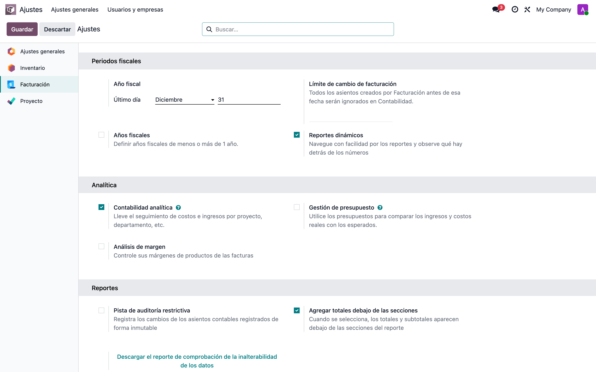

## 2. Plan analítico

**Contabilidad → Configuración → Planes analíticos**. El plan agrupa las cuentas y define si la imputación es opcional u obligatoria. En el demo se usa un plan **Proyectos**.

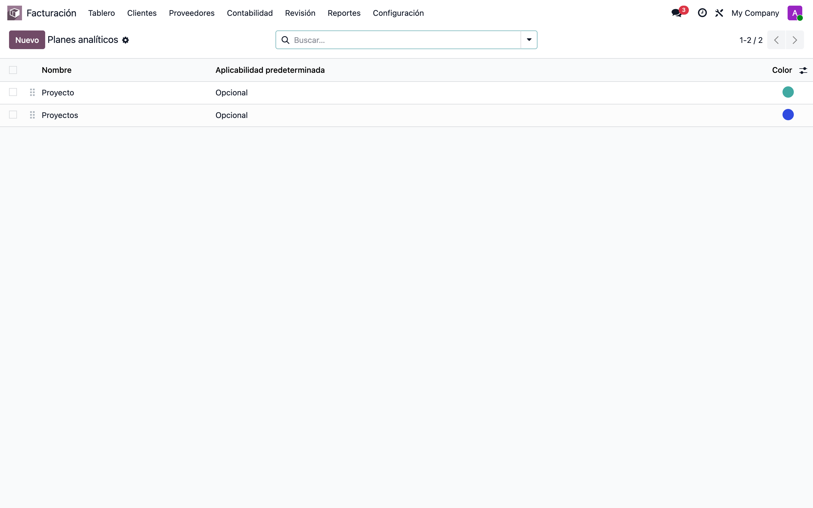

## 3. Una cuenta analítica por obra

**Contabilidad → Configuración → Cuentas analíticas**. Cada obra del cliente es una cuenta. El costo de los conduces se acumula aquí durante toda la ejecución del proyecto.

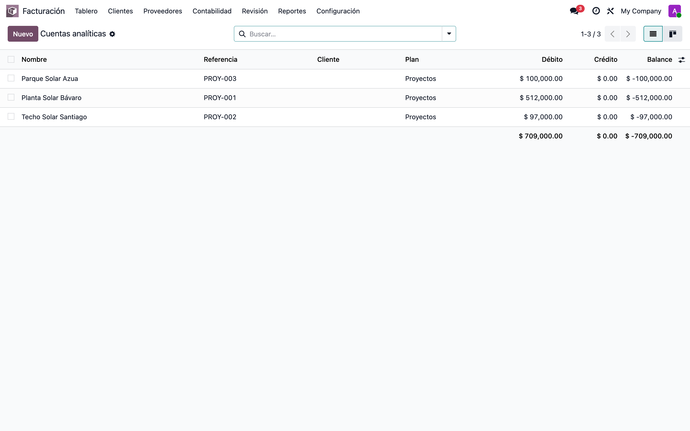

## 4. Imputar el conduce a una obra

En el conduce (**Inventario → Transferencias**), la pestaña *Operaciones* trae la columna **Distribución analítica**. Se llena por línea: cada producto puede ir a una obra distinta.

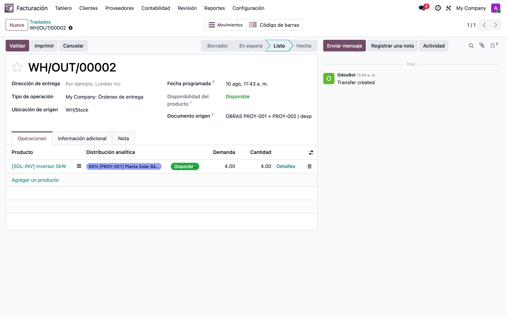

## 5. Repartir entre varias obras

Al hacer clic sobre la celda se abre el editor de distribución. Aquí el inversor se reparte **60 % a PROY-001 y 40 % a PROY-002**; Odoo genera una partida analítica por cuenta con el monto proporcional.

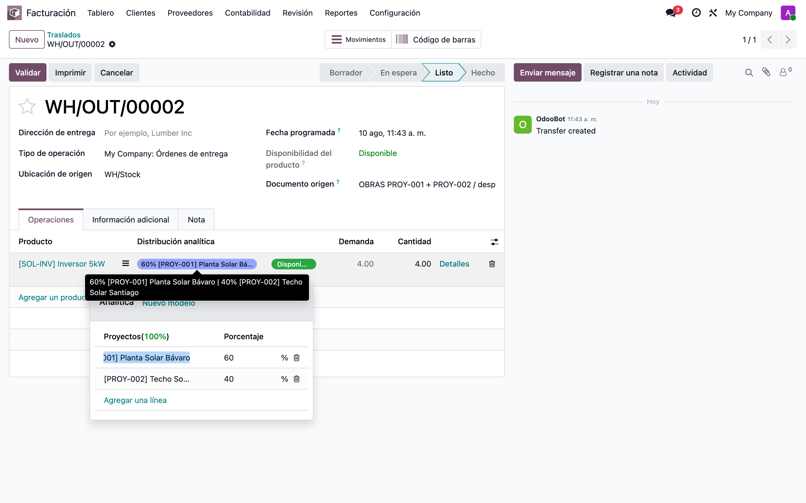

## 6. El costo se ve antes de validar

Éste es el punto clave para quien factura al cierre del proyecto. El conduce **WH/OUT/00002 sigue en estado Listo** (sin validar) y sus dos partidas analíticas ya existen, estimadas al **costo estándar** del producto: −108,000 a PROY-001 y −72,000 a PROY-002. Al validar, Odoo las reemplaza por la valoración real del movimiento.

Se consultan en **Contabilidad → Partidas analíticas**, junto a las de los conduces ya validados.

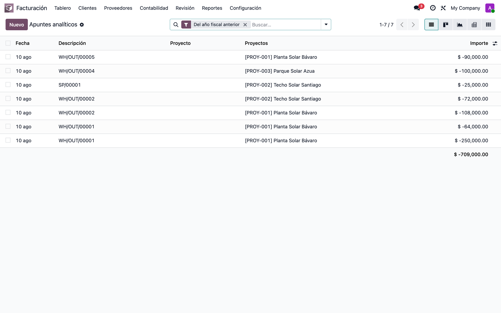

## 7. Conduce validado

Una vez validado el conduce, el monto de la partida analítica pasa a ser la **valoración real** del movimiento (`move.value`), con signo negativo por tratarse de una salida de almacén.

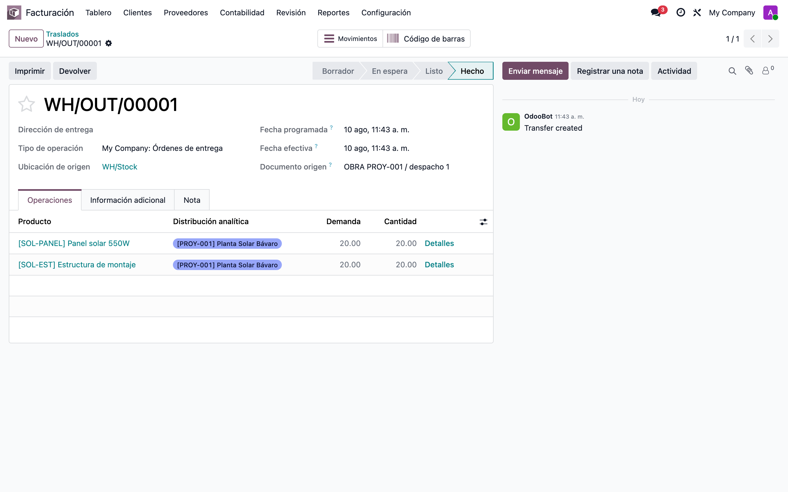

## 8. Costo acumulado por obra

Agrupando las partidas analíticas por cuenta se obtiene el costo de materiales imputado a cada obra, actualizado con cada conduce y sin esperar a la facturación.

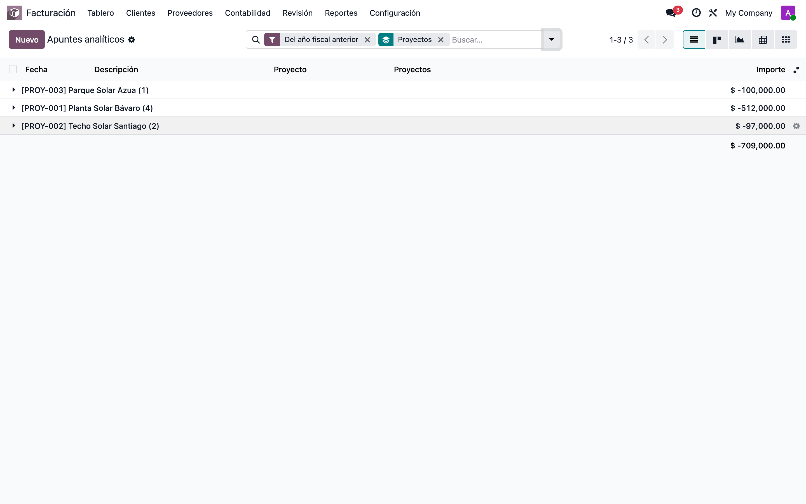

## 9. Ver el detalle desde la obra

Desde la cuenta analítica de la obra, el botón superior lleva al detalle de las partidas: producto, cantidad y monto de cada salida de almacén imputada.

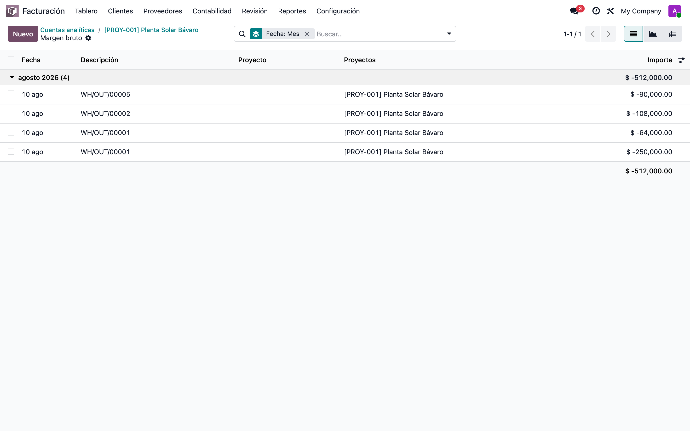

## 10. Desechos imputados a la obra

El material dañado en obra también se imputa: el formulario de **Desecho** (Inventario → Operaciones → Desechos) trae el mismo campo de distribución y, al validarlo, genera su partida analítica.

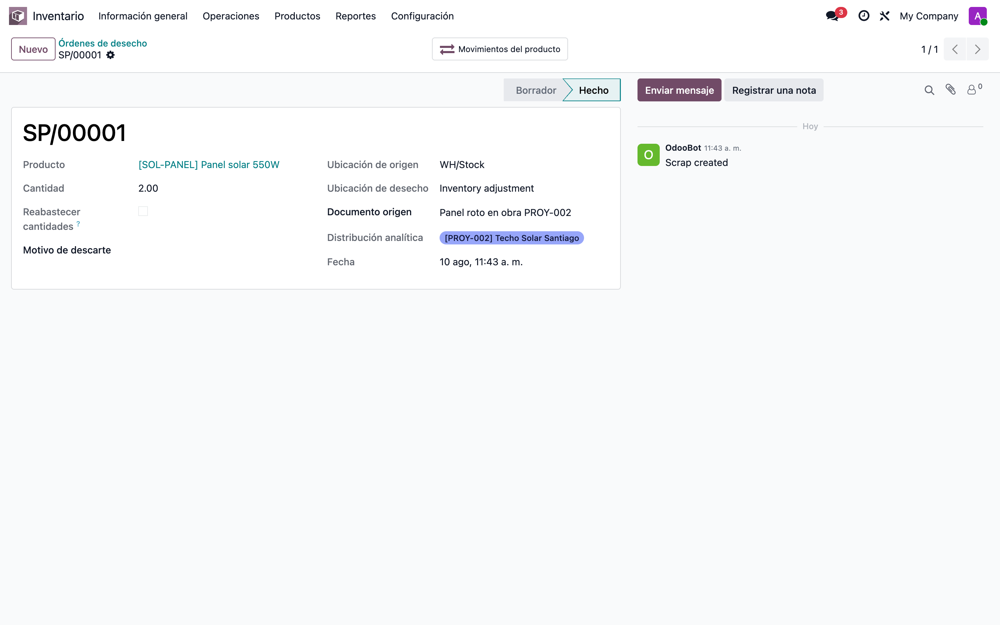

## 11. Convivencia con el flujo nativo por proyecto

Odoo 19 trae de fábrica otra vía: poner un **Proyecto** en el conduce y activar **Costos analíticos** en el tipo de operación. El módulo puente hace que las dos convivan con una regla simple: **si el movimiento tiene distribución manual, ésa gana; si no, se usa el proyecto del conduce.** Nunca se generan las dos, así que no hay doble conteo.

El conduce de la captura tiene proyecto *Parque Solar Azua* (PROY-003, visible en la pestaña *Información adicional*) **y** distribución manual a PROY-001: la partida analítica que generó es una sola, la de PROY-001. El WH/OUT/00004, mismo proyecto pero sin distribución manual, sí fue a PROY-003.

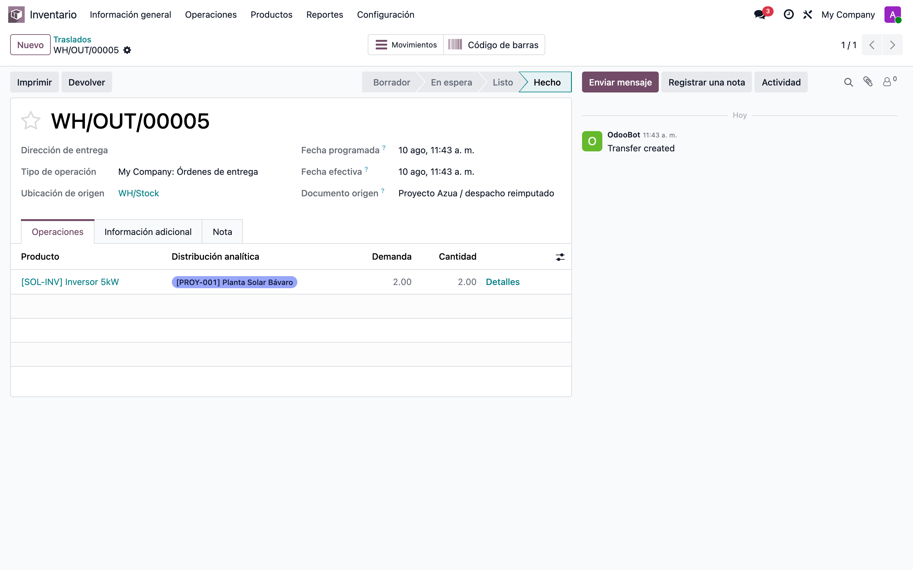

## 12. Hacer obligatoria la imputación

En el plan analítico, pestaña **Aplicabilidad**, se puede exigir la distribución para el dominio **Movimiento de stock**. Con `Obligatorio` —como quedó el demo— validar un conduce cuya distribución no sume 100 % lanza el error *«Una o más líneas requieren una distribución analítica del 100 %»*. La exigencia se puede acotar por categoría de producto.

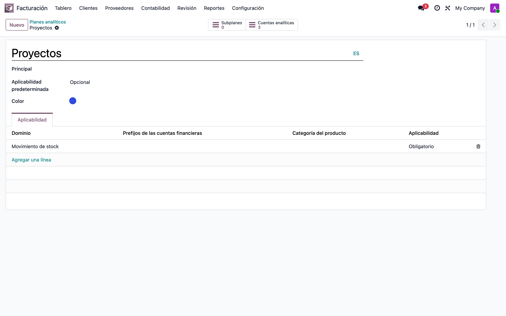

## 13. Qué cambia respecto al módulo OCA de 17.0

| | OCA `stock_analytic` (17.0) | `stock_analytic_distribution_features` (19.0) |
|---|---|---|
| Cómo llega la analítica | Inyectada en el apunte contable de valoración | Partida analítica directa desde el movimiento |
| Costo visible antes de validar | No | **Sí** (estimado al costo estándar) |
| Recálculo al cambiar cantidades | No | **Sí** |
| Reparto entre varias cuentas | Sí | Sí |
| Desechos | Sí | Sí |

**Contrapartida a tener en cuenta:** la distribución ya no queda marcada en el apunte contable de valoración. Cualquier reporte analítico armado sobre `account.move.line` cambia de forma; los que leen las partidas analíticas (Partidas Analíticas, cuenta analítica, rentabilidad de proyecto) siguen igual.

## Notas

**Migración desde 17.0.** Los nombres técnicos de campo, modelo y columna son idénticos a los de OCA `stock_analytic`, así que los datos sobreviven al upgrade sin transformación. Lo único obligatorio es renombrar el módulo instalado **antes** de arrancar Odoo 19 (`stock_analytic` → `stock_analytic_distribution_features`); de lo contrario Odoo lo da de baja y elimina las columnas `analytic_distribution`. El script está en `stock_analytic_distribution_features/migrations/pre_rename_stock_analytic.sql`.

**Base de pruebas.** `./setup_v19_stock_analytic_distribution_features.sh --recreate` levanta una base con los seis escenarios de este manual ya cargados y verifica que no queden partidas duplicadas.
