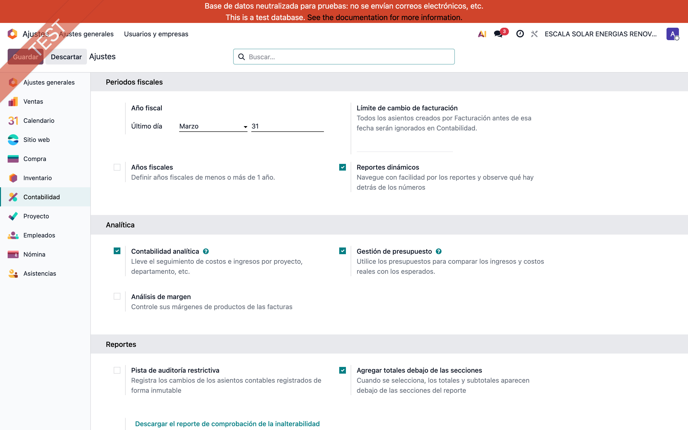
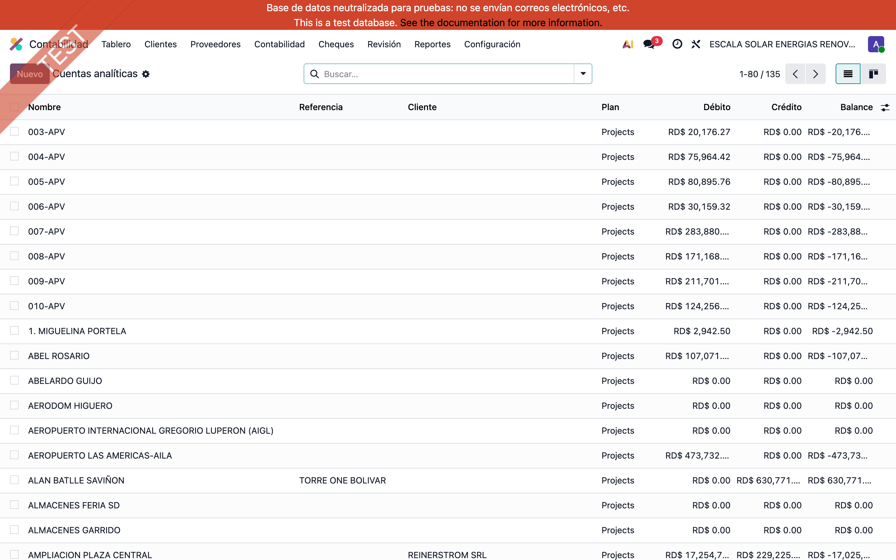
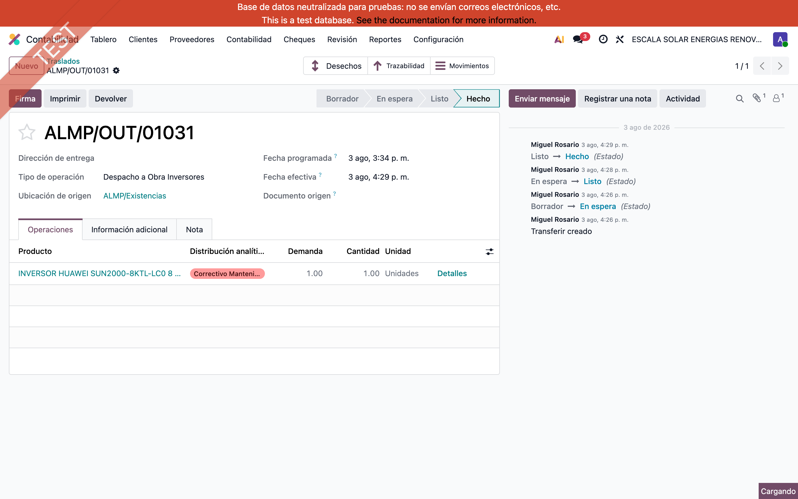
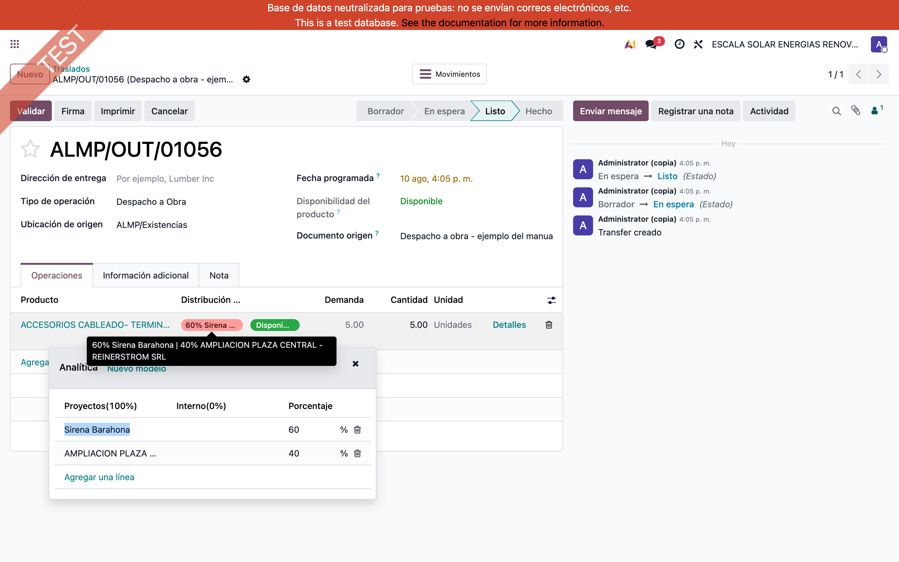
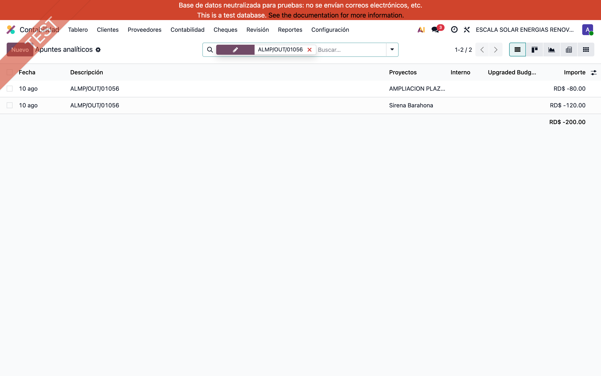
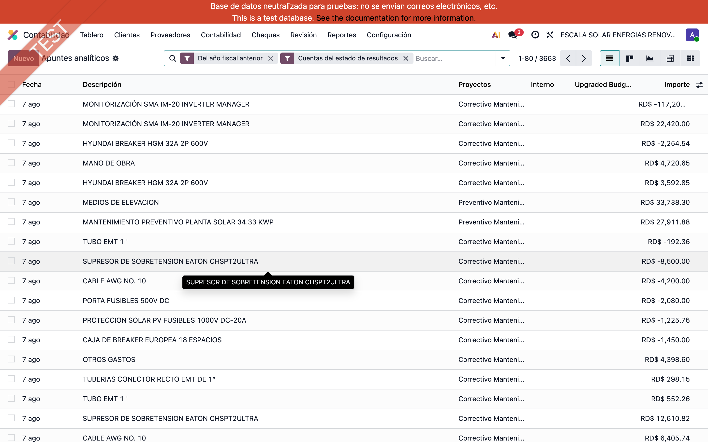
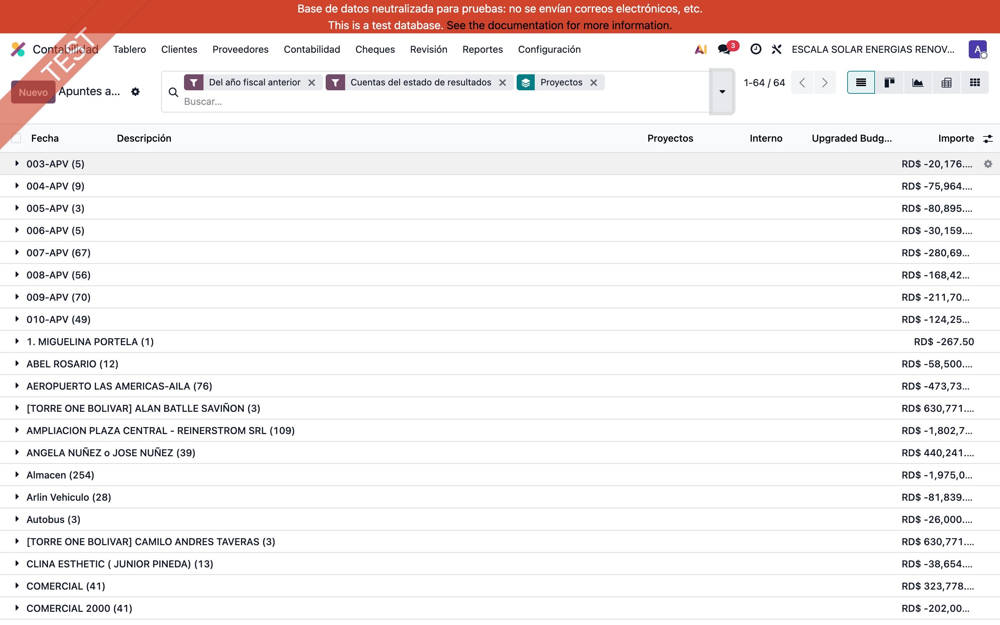
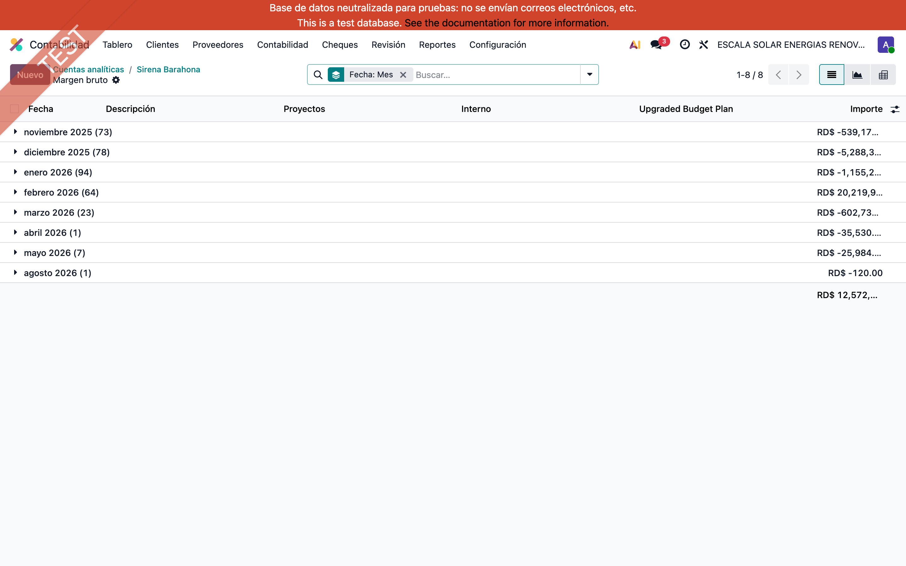

# Distribución analítica en conduces — Escala Solar

> Manual generado con `tools/manual-generator`. Las capturas se regeneran ejecutando el generador contra una base `test_v19_<módulo>`.

Manual del módulo **Stock Analytic Distribution**, capturado sobre la base de pruebas de Escala Solar ya migrada a Odoo 19 (`odoo-escalasolar-test-36198907`). Las pantallas muestran obras, productos y costos reales del cliente.

El módulo sustituye a OCA `stock_analytic`, que no existe para 19.0. Permite imputar el costo de las salidas de almacén a la obra correspondiente **desde el conduce**, sin esperar a la factura. Dos diferencias prácticas respecto al módulo anterior:

- El costo se ve **mientras la obra está en ejecución**: en cuanto el conduce se marca como preparado, Odoo calcula ya una estimación al costo del producto, y al validar la sustituye por la valoración real.
- Al cambiar la distribución o las cantidades, las partidas analíticas se **recalculan**; no se duplican.

La migración conservó los datos existentes: 1.621 movimientos y 1.663 líneas de movimiento mantienen su distribución analítica, y las 2.392 partidas analíticas de inventario generadas en 17.0 siguen intactas.

## Requisitos previos

- Contabilidad Analítica activada (Ajustes → Facturación → Analítica).
- Un plan analítico con una cuenta por obra — en Escala Solar, el plan **Projects**.
- Módulos `stock_analytic_distribution_features` y `stock_analytic_distribution_features_project` instalados.

## 1. Contabilidad Analítica activada

En **Ajustes → Facturación → Analítica**. Sin este ajuste el campo de distribución no aparece en ninguna pantalla: el módulo lo publica siempre con `groups="analytic.group_analytic_accounting"`. En esta base ya está activo para todos los usuarios internos.

## 2. Una cuenta analítica por obra

**Contabilidad → Configuración → Cuentas analíticas**, plan *Projects*. Cada obra del cliente es una cuenta, y el costo de los conduces se va acumulando ahí durante toda la ejecución.

## 3. Un conduce migrado desde 17.0

Conduce **ALMP/OUT/01031**, anterior a la migración. La columna **Distribución analítica** de la pestaña *Operaciones* conserva la imputación que se hizo en 17.0 con el módulo de OCA: los nombres técnicos de campo y columna son idénticos, así que el dato pasó sin transformarse.

## 4. El editor de distribución

Al hacer clic sobre la celda se abre el editor. Se puede imputar el 100 % a una obra o repartir el costo en porcentajes entre varias; Odoo generará una partida analítica por cuenta, con el monto proporcional.

## 5. El costo se ve antes de facturar

Éste es el punto que el cliente necesitaba. El conduce **ALMP/OUT/01056** está en estado **Listo**: preparado, pero **sin validar y sin facturar**. Su costo ya está imputado y repartido 60 % a *Sirena Barahona* y 40 % a *AMPLIACION PLAZA CENTRAL*, estimado al costo del producto.

Nota: la vista de Partidas analíticas trae por defecto los filtros *Del año fiscal anterior* y *Cuentas del estado de resultados*. Las partidas de inventario no llevan cuenta contable y son del ejercicio en curso, así que hay que quitar ambos filtros para verlas, como en la captura.

Al validar el conduce, Odoo sustituye la estimación por la valoración real del movimiento. Si se cambia la distribución o la cantidad, recalcula las partidas en lugar de añadir otras nuevas.

## 6. Las partidas analíticas del inventario

**Contabilidad → Partidas analíticas**. Aquí conviven las partidas migradas desde 17.0 —las que generaba el módulo de OCA desde el asiento de valoración— y las que produce el motor nuevo. Las dos alimentan igual el costo de la obra.

## 7. Costo acumulado por obra

Agrupando las partidas por cuenta analítica se obtiene el costo de materiales imputado a cada obra, actualizado con cada conduce y sin esperar a la facturación. Es la vista que responde a «cuánto llevo gastado en esta obra».

## 8. El detalle de una obra

Desde la cuenta analítica de la obra se llega al detalle de sus partidas: producto, cantidad y monto de cada salida de almacén imputada. Es la trazabilidad que permite justificar el costo acumulado línea por línea.

## 9. Qué cambia respecto al módulo de 17.0

| | OCA `stock_analytic` (17.0) | `stock_analytic_distribution_features` (19.0) |
|---|---|---|
| Cómo llega la analítica | Inyectada en el apunte contable de valoración | Partida analítica directa desde el movimiento |
| Costo visible antes de validar | No | **Sí**, estimado al costo del producto |
| Recálculo al cambiar cantidades | No | **Sí** |
| Reparto entre varias obras | Sí | Sí |
| Desechos | Sí | Sí |

**Contrapartida:** la distribución ya no queda marcada en el apunte contable de valoración. Cualquier reporte analítico armado sobre apuntes contables cambia de forma; los que leen las partidas analíticas —Partidas Analíticas, la cuenta analítica, la rentabilidad del proyecto— siguen igual. Las partidas históricas de 17.0 no se tocaron, así que el costo acumulado de las obras anteriores se mantiene.

## Notas

**Sobre estas capturas.** Se tomaron sobre `odoo-escalasolar-test-36198907` con los datos reales del cliente ya migrados. El conduce ALMP/OUT/01056 se creó únicamente para ilustrar el paso 5 y se eliminó al terminar, sin validarlo: no movió existencias ni generó asientos contables.

**Estado de la migración verificado en esa base:** el módulo `stock_analytic` de OCA ya no figura en el registro, `stock_analytic_distribution_features` y su puente están instalados, los tres campos `analytic_distribution` pertenecen al módulo nuevo, y ninguna de las cuentas analíticas referenciadas quedó rota.
