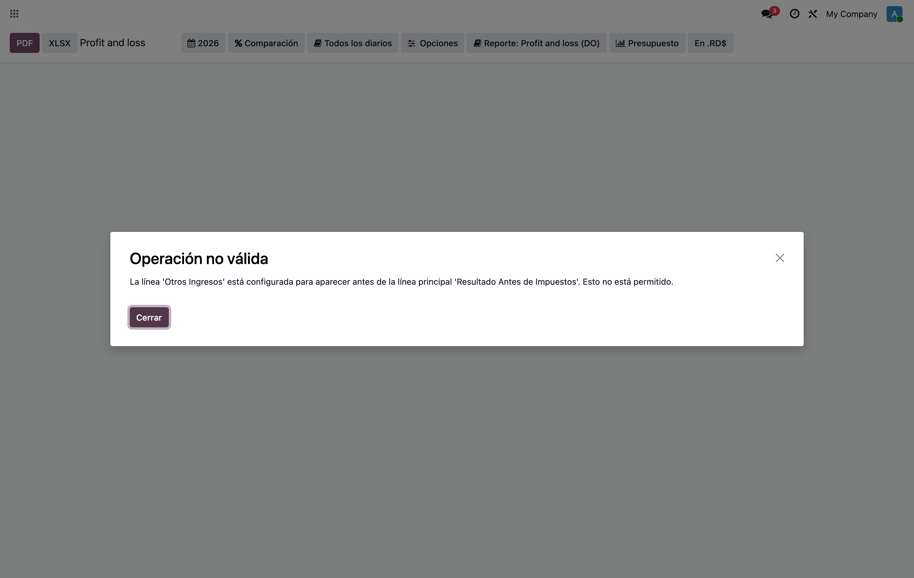
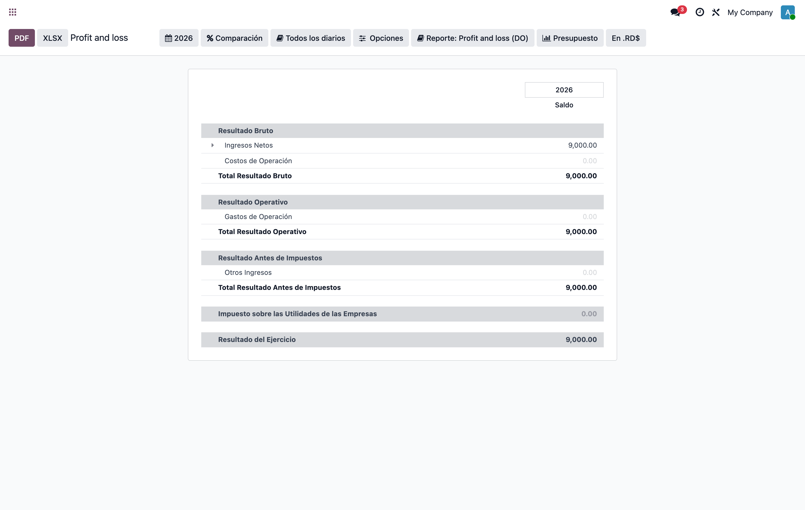

# Estado de Resultados — "Otros Ingresos" se sale de la estructura

**Reporte afectado:** Estado de Resultados (Profit and Loss, variante DR)
**Módulo que lo instala:** `l10n_do_reports` (Odoo **Enterprise**), **no** `l10n_do` ni `l10n_do_accounting`.
**Versiones:** reproducido en v17 y v19 (mismo origen).
**Fecha:** 2026-06-24

---

## 1. Síntoma

"Otros Ingresos" se sale de su grupo ("Resultado Antes de Impuestos"). Si la mueves
a mano en el editor del reporte, funciona; al **actualizar la base (`-u`)** se vuelve a dañar.
En el caso extremo el reporte ni carga y muestra:

> **Operación no válida** — La línea 'Otros Ingresos' está configurada para aparecer antes de
> la línea principal 'Resultado Antes de Impuestos'. Esto no está permitido.



---

## 2. Causa raíz

El archivo `enterprise/l10n_do_reports/data/profit_and_loss.xml` (y `balance_sheet.xml`)
abre con `<odoo>` **sin** el atributo `auto_sequence="1"`.

- El cargador XML de Odoo (`odoo/tools/convert.py`) solo asigna `sequence` incremental
  (10, 20, 30…) a cada registro **si el `<odoo>` tiene `auto_sequence="1"`**
  (`_tag_root` → `next_sequence`). Sin él, **toda** línea queda con `sequence = NULL`.
- El modelo `account.report.line` ordena por `_order = 'sequence, id'` y el render
  (`account_reports/models/account_report.py:2714`) **exige que cada hija salga después de su
  línea padre**; si no, lanza el `UserError` de arriba.
- Con **todas** las secuencias en NULL el orden cae a `id` (orden de creación), que
  *por casualidad* respeta la jerarquía → se ve bien. Es un equilibrio frágil.
- En PostgreSQL los NULL ordenan **al final** (`NULLS LAST`). Basta que **una** línea reciba
  un `sequence` no-NULL (un arrastre en el editor, un script de migración, Studio, cualquier
  `write` parcial) para que esa línea salte **delante** de todas las hermanas NULL → "Otros
  Ingresos" se sale de la estructura.
- Por qué "al actualizar se daña": como el XML **no** trae `auto_sequence`, el `-u`
  **nunca reescribe** `sequence`. No corrige el estado torcido; lo deja como esté.

Verificado en DB real — todas las líneas con `sequence` NULL:

```
id=104 seq=None parent=-    l10n_do_pl_gross_income
id=110 seq=None parent=109  l10n_do_pl_income_other   <- Otros Ingresos (hija de ebt=109)
...
```

Al forzar `income_other.sequence = 5` (resto NULL) el render falla con el `UserError` exacto.

La mayoría de localizaciones de Odoo (l10n_it, l10n_us, l10n_pk) y el reporte raíz
`account_reports/data/profit_and_loss.xml` **sí** usan `auto_sequence="1"`. `l10n_do` quedó sin él.

---

## 3. Solución

Agregar `auto_sequence="1"` al `<odoo>` de los dos archivos de `l10n_do_reports`:

```diff
- <odoo>
+ <odoo auto_sequence="1">
      <record id="l10n_do_pl" model="account.report">
```

```diff
- <odoo>
+ <odoo auto_sequence="1">
      <record id="l10n_do_bs" model="account.report">
```

Archivos:
- `enterprise/l10n_do_reports/data/profit_and_loss.xml`
- `enterprise/l10n_do_reports/data/balance_sheet.xml`

Luego: `odoo -d <db> -u l10n_do_reports --stop-after-init`

Con esto **cada** línea recibe `sequence` 10,20,30… en orden del documento en **cada** carga
(install y update). Las hijas siempre quedan después del padre, el orden es **determinista y
estable**, y el `-u` **auto-corrige** cualquier estado torcido previo.



Tras el fix, las secuencias quedan fijas y "Otros Ingresos" anida bajo "Resultado Antes de Impuestos":

```
id=104 seq=30  Resultado Bruto
id=105 seq=40  Ingresos Netos
id=106 seq=50  Costos de Operación
id=107 seq=60  Resultado Operativo
id=108 seq=70  Gastos de Operación
id=109 seq=80  Resultado Antes de Impuestos
id=110 seq=90  Otros Ingresos        <- correcto, después de su padre (80)
id=111 seq=100 Impuesto s/ Utilidades
id=112 seq=110 Resultado del Ejercicio
```

### Dónde aplicar el fix (trade-off)

`l10n_do_reports` es código de **Odoo Enterprise** (submódulo `enterprise/`).

- **Opción A — parchear el archivo directamente** (lo hecho aquí). Mínimo, exacto, igual a la
  convención de upstream. Riesgo: un pull de enterprise puede revertirlo → llevarlo como
  parche versionado en tu repo.
- **Opción B — módulo override en `odoo-pro`** que dependa de `l10n_do_reports` y fije
  `<field name="sequence">` explícito en cada `ref` de línea. Sobrevive upgrades de enterprise
  y se re-afirma en cada `-u`. Hoy **ningún** módulo de `odoo-pro` depende de `l10n_do_reports`,
  así que requiere módulo nuevo (o agregar la dependencia).

Recomendado: además reportar el bug a Odoo (falta `auto_sequence` en `l10n_do_reports`).

---

## 4. Cómo replicar

Script: `replicate_pnl_otros_ingresos_sequence.sh` (raíz del repo). Resumen:

1. Copia una DB con `l10n_do_reports` instalado → `repro_pnl_broken`.
2. `UPDATE account_report_line SET sequence=5 WHERE ...income_other` (simula el arrastre/migración).
3. Abrir el reporte → error "Otros Ingresos … aparecer antes de … Resultado Antes de Impuestos".
4. Aplicar `auto_sequence="1"` + `-u l10n_do_reports` → secuencias 10,20,30… → reporte correcto.

DBs de prueba dejadas en pie: `repro_pnl_broken` (roto), `repro_pnl_seq` (corregido).
